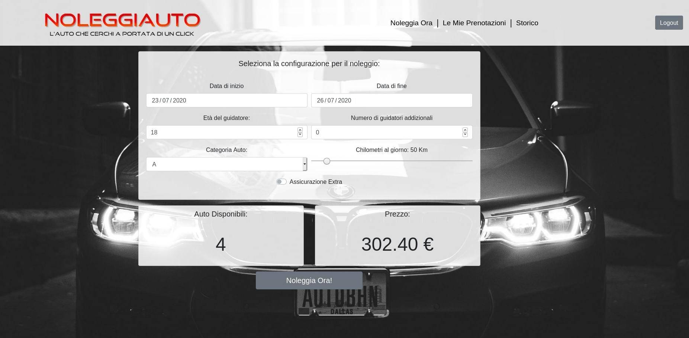

# Exam #1: "Noleggio veicoli"
## Student: s278012 VUILLERMOZ SIMONE 

## React client application routes

- Route `/login`: è la pagina contenente il form di login e la lista di tutti i veicoli presenti nel database. Sono presenti, inoltre, i filtri su categoria e marca per decidere quali veicoli mostrare.
- Route `/configurazione`: si tratta della prima pagina visualizzata una volta effettuato con successo il login. La pagina si presenta con un form richiedente diversi input che se inseriti correttamente mostrano le auto disponibili per il noleggio (se ce ne sono), l'eventuale prezzo per la soluzione scelta e il bottone per confermare la scelta e procedere al pagamento. Nel caso in cui uno dei form non venisse compilato nel modo corretto (es: data finale minore della data inziaile) i risultati non sono mostrati. Se, invece, i form sono stati correttamente compilati, ma non sono presenti veicoli per la configurazione richiesta sarà stampato un messaggio informativo. E' possibile accedere a questa pagina in qualunque momento una volta loggati premento su "Noleggia Ora".
- Route `/pagamento`: è una pagina accessibile solamente dalla route precedente. Cliccando sul bottone "Noleggia Ora!" della pagina di configurazione, infatti si è reinderizzati a questa pagina che contiene un form tramite il quale il cliente potrà inserire tutti i dati relativi alla propria carta di credito e procedere al pagamento. Una volta effettuato il pagamento si è reindirizzati alla pagina di prenotazioni.
- Route `/prenotazioni`: E' una pagina accessibile in qualunque momento per un utento loggato tramite un link "Prenotazioni" sull'header della pagina. Contiene una tabella con tutte le prenotazioni effettuate dall'utente (noleggi con data di inizio futura) e ne permette la cancellazione tramite il bottone "Elimina Prenotazione". Nel caso in cui l'utente non avesse salvata nel database alcuna prenotazione compare il messaggio "NESSUNA PRENOTAZIONE PRESENTE".
- Route `/storico`:  E' una pagina accessibile in qualunque momento per un utento loggato tramite un link "Storico" sull'header della pagina. Contiene una tabella con tutti i noleggi in corso o terminati dall'utente (noleggi con data di inizio presente o passata). Nel caso in cui l'utente non avesse salvato nel database alcuno storico compare il messaggio "NESSUNO STORICO PRESENTE".

## REST API server

- POST `/api/login`
  - Request Body => username, password
  - Response Body =>
	- successo : id di user loggato, nome user loggato;
	- errore : json contenente il tipo di errore (wrong password o invalid username o altro)
Verifico la password dello user facendone l'hash e confrontandolo con l'hash contenuto nel database. Nel caso di hash uguali la password risulta corretta e comunico al client la correttezza del login. Inoltre, creo lato server un token basato su jwt secret che consentirà di rendere private alcune api e permetterne la chiamata solo agli utenti loggati. 
- POST `/api/logout`
  - Request Body: nessuna informazione passata al server
  - Response Body: l'unica informazione importante è lo status che può essere 200 nel caso in cui il logout sia stato effettuato da un utente loggato o 401 nel caso in cui la chiamata dia non autorizzata (non possiede il token).
Questa API si limita ad eliminare il token precedentemente creato tramite login.

- GET `/api/automobili` 
  - Request URL: nessuna informazione passata al server.
  - Response Body: in caso di successo vengono ritornate tramite vettore di json tutte le automobili presenti nel database. 
Si tratta di una api pubblica, richiamabile anche se non si possiede il token basato su jwtSecret.

- GET `/api/user` 
  - Request URL: nessuna informazione passata al server
  - Response Body: si ritorna in caso di successo l'id e il nome dello user già possessore del token.
Verifica che la richiesta sia effettuata da uno user che è presente nel database. In tal caso significa che l'utente ha già effettuato il login.

- GET `/api/noleggi` 
  - Request URL: data di inzio noleggio, data di fine noleggio e categoria del veicolo
  - Response Body: numero totale di veicoli della categoria passata dal client disponibili per le date passate dal client e id di un veicolo.
Verifica la presenza e la correttezza delle date e poi ritorna un json contenente il numero di veicoli disonibili (tot) e l'id di uno di questi veicoli(id).

- GET `/api/prezzo` 
  - Request URL: id dello user, categoria dell'auto, chilometri, età del guidatore, numero guidatori addizionali, assicurazione(true/false), numero dei veicoli disponibili, durata del noleggio in giorni.
  - Response Body: in caso di successo ritorna un json contenente solo un intero corrispondente al prezzo della configurazione scelta.
date tutte le informazioni sul noleggio ne calcola il prezzo e lo ritorna al client.

- POST `/api/pagamento` 
  - Request Body: json pagamento contenente tutte le informazioni sul pagamento (nome titolare carta, cvv, mese e anno di scadenza, prezzo da pagare).
  - Response Body: non ritorna nessun informazione aggiuntiva allo status della response.
Dopo aver verificato la presenza di tutti i campi necessari al pagamento ritorna un successo o insuccesso a seconda di questa verifica.

- POST `/api/noleggio` 
  - Request Body: json noleggio contenente tutte le informazioni sul noleggio da inserire nel database.
  - Response Body: non ritorna nessun informazione aggiuntiva allo status della response.
Dopo aver verificato la presenza del json noleggio lo aggiunge nel database come nuovo noleggio e restituisce lo stato dell'operazione. 

- GET `/api/prenotazioni` 
  - Request URL: id dello user, data per cui filtrare i noleggi. Nel caso si vogliano i noleggi con data di inizio futura alla data di oggi bisogna passare al database la data odierna.
  - Response Body: restituisce tutti i noleggi con userid uguale a quello passato e data di inizio futura a quella passata nella chiamata.

- DELETE `/api/noleggio/:id` 
  - Request URL: id del noleggio da eliminare
  - Response Body: non ritorna nessun informazione aggiuntiva allo status della response. 

- GET `/api/storico` 
  - Request URL: id dello user, data per cui filtrare i noleggi. Nel caso si vogliano i noleggi con data di inizio passata o uguale alla data di oggi bisogna passare al database la data odierna.
  - Response Body: restituisce tutti i noleggi con userid uguale a quello passato e data di inizio passata o uguale a quella passata nella chiamata.

## Server database

- Table `user` - contiene tutti gli utenti registrati al sito con id, il loro nome, il loro username e l'hash della loro password.
- Table `noleggio` - contiene tutti i noleggi presenti con id, id dello user che ha effettuato il noleggio, id dell'automobile corrispondente al noleggio, data di inizio, data di fine, prezzo, numero di guidatori addizionali, età del guidatore, presenza dell'assicurazione, numero di chilometri giornalieri.
- Table `automobile` - contiene tutte le automobili con id, categoria, marca e modello del'auto.

## Main React Components

- `Automobili` (in `Automobili.js`): contiene una tabella con le informazioni riguardanti i veicoli presenti nel database.
- `Configurazione` (in `Configurazione.js`): contiene un form che permette la creazione di una configurazione di noleggio. In questo componente vengono validati tutti i form.
- `Filters` (in `Filters.js`): contiene tutti i filtri di categoria e marca per le automobili sotto forma di checkbox.
- `Header` (in `Header.js`): si tratta dell'header del sito. E' diverso a seconda che l'utente sia loggato o meno. Nel primo caso contiene link per navigare nella pagina, altrimenti contiene solamente il logo dell'autonoleggio.
- `Login` (in `Login.js`): si tratta di un componente che contiene il form per il login ed il bottone di login.
- `LoginError` (in `LoginError.js`): viene richiamato in caso di errore di login, si tratta di un toast che genera un messaggio con le informazioni riguardo all'errore.
- `Pagamento` (in `Pagamento.js`): è il componente che contiene i form per poter inserire i dati riguardo al pagamento.
- `Prenotazioni` (in `Prenotazioni.js`): tabella che mostra tutte le prenotazioni effettuate dall'utente. In ciascuna riga della tabella è presente un bottone che ne permette la cancellazione.
- `Risultati` (in `Risultati.js`): è il componente che compare quando una configurazione è valida (tutti i form compilati correttamente). Può contenere il numero di auto disponibili e il relativo prezzo oppure un messaggio che comunica l'assenza di veicoli disponibili.
- `Storico` (in `Storico.js`): tabella che mostra tutti i noleggi correnti o passati.

## Screenshot

## Test users

* username: "marioRossi" , password: "password" (frequent customer)
* username: "giorgioBianchi" , password: "password"
* username: "lucaVerdi" , password: "password"
* username: "annaNeri" , password: "password"
* username: "saraGialli" , password: "password"
